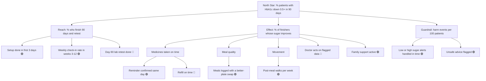

# Project Pulse: Full Project Context

Last updated: 8 October 2026
Purpose of this file: one place that holds everything we know and have decided, so any new chat or teammate can pick up the work without re-reading the whole thread.

---

## 1. The Task in One Paragraph

I am the Founding Product Manager at Project Pulse, a stealth-mode health-tech startup in India. In 24 hours I must define, prototype and pitch the MVP that proves software can measurably improve a person's health (body, mind, or both) and that this can become a durable business. The founders' vision is a "Continuous Care Stack" that lives on the patient's phone and stays with them every day, not every quarter. The long-term hope is to manage and even reverse chronic disease, but any such claim must be backed by a plan to prove it.

**Core tension:** Stickiness (patients stay and engage) versus Clinical Impact (patients actually get healthier).
- A product people love that doesn't improve health is a toy.
- A product that works but nobody sticks with is a clinic.
- Investors fund neither.

**Rule on outside research:** it must be cited, and it cannot override the case data.

---

## 2. Case Data (treat as true)

| Fact | Number |
|---|---|
| Average doctor consultation for chronic patients | ~15 minutes, once every 3 months |
| Patients who abandon a lifestyle regimen | ~60% within 3 weeks |
| Health app users still active after 90 days | ~12% |
| People with depression or anxiety who get any treatment | ~1 in 5 |
| Chronic physical condition patients who also show signs of depression or anxiety | ~1 in 4 |
| Adults who would not tell family about a mental health condition | ~1 in 2 |
| Wait for a therapist or psychiatrist outside metros | 3 to 6 weeks |
| Patients who say they trust WhatsApp health advice | ~1 in 3 |
| Smartphone users among chronic patients in Tier 2/3 cities | ~70%, mostly budget Android |
| Monthly health spend called "affordable" | under ₹500 |
| Patients whose family member is involved in daily health decisions | ~65% |

---

## 3. The Problem Statement (Five Forces)

The chronic care journey in India suffers from an **Engagement Gap** and a **Trust Deficit**. Five forces keep patients stuck:

1. **The Episodic Disconnect.** 15 minutes every 3 months. For the other 90 days the doctor has no view of food, sleep, stress or movement, so prescriptions stay generic and fail.
2. **The Motivation Decay.** Willpower runs out. Most patients quit within weeks. Many products optimise for app opens, not health, so a user can be "engaged" and still get sicker.
3. **The Data Silo.** Lab reports, watch steps, paper prescriptions and unrecorded meals sit in different places. No "central brain" connects them or explains why a person's body and mood respond the way they do.
4. **The Misinformation Trap.** Patients learn from WhatsApp forwards, YouTube and wellness influencers. Fad diets spread faster than medical advice, and some are dangerous for these exact conditions.
5. **The Stigma Wall.** Depression, anxiety and chronic stress are widespread but hidden. Many don't recognise symptoms, and many who do won't seek help for fear of judgement. Body and mind are treated in separate silos even though each worsens the other.

The strongest submissions understand how solving one force can make another worse.

---

## 4. The Four Patient Profiles (founders' shortlist)

We may choose one, combine them, or argue for someone else. We must justify why they come first.

- **Ramesh, 56, Kanpur.** Retired railway clerk, Type 2 diabetes for 8 years. Takes three medicines, often forgets one. Budget Android phone, comfortable with WhatsApp and YouTube only. His son in Pune books his doctor visits and orders his medicines online. His wife cooks for the whole family and doesn't change the menu for him.
- **Ananya, 24, Bengaluru.** Software engineer with PCOS diagnosed last year. Irregular sleep, high stress, orders food 4 to 5 times a week. Very comfortable with apps and wearables. Deeply private about her condition. Already tried two fitness apps and an Instagram diet plan.
- **Sunita, 42, Indore.** School teacher with hypertension and early signs of pre-diabetes. Cares for two children and her mother-in-law. Almost no personal time. Her husband's company offers a wellness benefit she has never used. Willing to change but can't find the time.
- **Rohan, 27, Hyderabad.** Sales executive, moved cities a year ago. Months of low mood, poor sleep and loss of interest, calls it "just stress." Gained 9 kg, recently told he is borderline hypertensive. Has never spoken to a mental health professional and doesn't want his parents to find out.

**People around the patient (the product is judged on how it handles them):**
- The doctor: controls prescription and trust, has very little time.
- The mental health professional: scarce, expensive, far away.
- The family: cooks, pays, reminds, worries, or carries the stigma.
- The payer: the patient, their employer, or an insurer. Each wants something different.

---

## 5. What the Submission Must Contain

### Seven decisions (each needs a clear choice and a clear reason)
1. **The Beachhead.** Condition, patient, geography. Why it's the right first battle and what winning unlocks next.
2. **The Signal.** How the product knows what is happening in the patient's body and mind, how accurate that must be, and what we give up to get it.
3. **The Intervention.** What the product does to change behaviour. What happens on Day 1, Week 3 and Day 90.
4. **The Role of Humans.** Where doctors, therapists, coaches or family enter the loop, and what happens when the product is wrong.
5. **The Guardrails.** How we make sure we improve health, not just app usage, and protect a vulnerable patient from our own product.
6. **The Hook.** Why a patient picks us over free content, a neighbourhood dietitian, or just the doctor's prescription.
7. **The Business Model.** Who pays, how much, when, and why they keep paying.

### Second-order thinking (mandatory)
For the three most important product decisions, state:
- What problem the decision solves
- What new problem it creates
- How we handle, accept or measure that new problem

Features presented without side effects will be marked down.

### Metrics (must form a chain, not a list)
1. **One North Star health metric:** a measurable biomarker or validated clinical outcome, with target, time frame and share of users expected to hit it.
2. **One leading behaviour metric:** observable within days or weeks, predicts the health metric will move.
3. **One business metric:** revenue, retention, LTV or similar.
4. **The causal link:** why moving the health metric will move the business metric.

**Penalised:** vanity metrics (downloads, sign-ups, app opens), targets with no time frame or baseline, medically implausible health targets.

---

## 6. Constraints

**Medical and regulatory**
- No diagnosis or prescription by software. Only a registered medical practitioner can diagnose, prescribe or change medication. Only a qualified mental health professional can deliver clinical therapy. We may inform, nudge and coach.
- Health data is sensitive. Mental health data is among the most sensitive. Assume Indian data protection law: explicit informed consent per data type, clear purpose for each, and the right to withdraw and delete.
- No unproven medical claims. We can't say "cure" or "reverse" unless the pitch explains how we'd prove it.
- Any hardware must already exist and be legal in India.

**Product and operational**
- India-first: Indian food, Indian family structures, Indian price sensitivity.
- Phone reality: budget Android, patchy internet. If the product only works for premium users, we must justify it.
- **Mobile-only web app:** The web app for son, wife, doctor, and coordinator is designed exclusively for mobile viewport (390×844). No desktop or tablet layouts. All users access it from their phones. Dark theme, card-based UI, bottom navigation bar.
- Language: if the beachhead is outside metros, we must address language.
- **Safety net (mandatory):** a defined response for a medical or mental health emergency signal (dangerously high or low reading, severe distress, risk of self-harm), including how the user reaches qualified human help.
- **Single launch city or region.** No national launch on Day 1.

**Scope rules**
- One primary beachhead only. Expansion can be mentioned, but the prototype and metrics are for one.
- The prototype must show at least one complete user journey end to end, not disconnected screens.
- **Watch this space:** founders may share new information during the sprint. How we respond will be evaluated.

---

## 7. Decisions Made So Far

### Beachhead patient: Ramesh, 56, Kanpur (Type 2 diabetes)
Chosen because:
- His outcome is easy to measure: HbA1c (3-month blood sugar average) plus daily sugar readings.
- His main gap is simple and fixable: he forgets one of three medicines.
- His son already books visits and orders medicines. About 65% of patients have a family member in daily decisions.
- Budget Android and WhatsApp-first, so the product must be light and in Hindi.

Why not the others:
- **Rohan:** mood is harder to measure and riskier to get wrong in a 24-hour sprint.
- **Ananya:** PCOS has no single clean number, the space is crowded with free content, she's a metro app-savvy user (feels less India-specific), and her privacy means the family lever mostly doesn't apply.
- **Sunita:** close second. Home BP can be checked cheaply, results could show in 4 to 8 weeks, and her husband's employer is a ready payer. Placed behind Ramesh because her core problem is time, which means the product must win on engagement before it can prove health impact. A fair alternative if the pitch should lean on speed of proof and an employer as payer.

### Platform decision: Mobile-only web app
The web app (for son, wife, doctor, coordinator) targets **mobile viewport only** (390×844). No responsive design for desktop or tablet. Rationale:
- Son accesses from his phone in Pune. Wife uses her phone at home. Doctor checks between patients on their phone. Coordinator triages on mobile.
- Building for one viewport saves significant dev time in a hackathon.
- Dark theme, card-based layout with glassmorphism, bottom navigation bar — modern mobile-first aesthetic.
- Desktop/tablet support is a post-hackathon item.

### North Star (proposed, an assumption to defend, since the case gives no baselines)
% of enrolled patients whose HbA1c drops by at least 0.5 points in 90 days.

**Guardrails:** no rise in low-sugar events, no missed emergency alerts, no medicine changes by software.

**Formula:**
`North Star = % who finish 90 days and retest × % of finishers whose sugar actually improves`
`Improvement = Medicines on time + Better meals + More movement + Doctor acts on data + Family support`

---

## 8. KPI Driver Tree

🟢 = PM team controls it. 🔴 = depends on another team or partner.

### Metric table

| Metric | Definition | How to measure | Owner | Product lever |
|---|---|---|---|---|
| Setup done in 3 days | Profile, medicine list and family link complete | Finished ÷ started | PM | Short Hindi setup, voice option, son helps by phone |
| Weekly check-in rate | Logs at least 3 things a week | Active-in-week ÷ enrolled, weeks 3 to 12 | PM | WhatsApp reminders, one-tap replies |
| Day-90 retest done | Second HbA1c test completed | Retests ÷ finishers | Lab partner and ops | Home pickup booked by the son |
| Reminder confirmed same day | "Taken" tapped within the day | Confirmed ÷ scheduled doses | PM | Fixed meal-time reminder, nudge to son if missed |
| Refill on time | Reorder before run-out | Refills before run-out ÷ refills due | Pharmacy partner and son | Refill alert to the son |
| Meals with better-plate swap | Meals where a lower-sugar swap is chosen | Swaps ÷ meals logged | PM | Tap logging of Indian plates, simple swaps |
| Post-meal walks | 10-minute walks after the biggest meal | Walks per week | PM | Voice prompt, no wearable needed |
| Doctor acts on flagged data | Doctor reviews a flag within 7 days | Reviewed ÷ total flags | Clinical team | One-page weekly doctor summary |
| Family support active | Family member replies to weekly summary | Replies ÷ summaries sent | PM | Short weekly WhatsApp summary |
| Harm events per 100 patients | Low sugar, very high sugar or distress not handled in time | Events missed past response window ÷ 100 patients | PM and clinical team | Alert rules, human call-back, emergency path |

**Highest-leverage metrics:** medicines taken on time, and day-90 retest done (without the retest we can't prove the result).

---

## 9. Problem Framing Canvas (Ramesh)

1. **True problem:** Ramesh's diabetes is decided in the 90 days between doctor visits, and nobody supports him during those days. The deeper issue is that there is no daily loop connecting Ramesh, his family and his doctor.
2. **Customers:** Ramesh (user); his son in Pune (helper and likely payer); his wife (decides what's on his plate); his doctor (controls the prescription and trust). Wider group: patients with a family member in daily decisions (~65%) and smartphone users in Tier 2/3 cities (~70%).
3. **How we know it's real:** the 15-minute-per-3-months gap; ~60% quit within 3 weeks; ~12% app retention at 90 days; only ~1 in 3 trusts WhatsApp advice yet it fills the gap; families already involved. **Still to test with Kanpur patients:** how often and why doses are missed, whether son and wife would take a weekly summary, whether Ramesh will share data with family.
4. **Value:**
   - Ramesh: fewer missed medicines, lower sugar, fewer scares (long-term complication reduction is a hope to prove, not promise). Must arrive at under ₹500 a month.
   - Son: peace of mind. Wife: simple meal tips without a separate menu. Doctor: a weekly summary instead of three blank months.
   - Business: a provable result for investors, longer-lasting users, a payer who can see the value, and a path to hypertension and mood later.
5. **Why now:** phones and WhatsApp are already in hand; misinformation fills the gap today; existing apps fail at 90 days; families are already involved; each quarter of waiting is another 90 unmanaged days. (Keep this short in the pitch. Outside trends can't override case data.)

---

## 10. Product Outcomes and Features

### Outcome 1: Medicines taken on time
Medicine setup from a prescription photo; Hindi WhatsApp reminders (text plus voice note); one-tap "taken"; missed-dose nudge to the son; refill alert to the son; "feeling unwell after this medicine" button.
Watch: too many reminders; the son acting like a supervisor.

### Outcome 2: Day-90 retest done
Day-0 baseline test with home pickup; day-90 retest reminders; before-and-after progress message; results to the doctor.
Watch: people whose sugar didn't improve may skip the retest. Keep the message kind, send worse results to a doctor call, and report results for everyone enrolled, not only those who returned.

### Outcome 3: Better meals and movement
Tap meal log of Indian plates; swap suggestions for foods he already eats (doctor-approved); weekly "family pot" message to his wife; optional after-meal sugar check; 10-minute walk prompt.
Watch: guilt, food anxiety, the wife feeling blamed.

### Outcome 4: Safe for the patient
Emergency alert rules; human call-back; fortnightly mood check; privacy and consent controls; medical-advice block.
Watch: false alarms causing alert fatigue; call-back cost.

### Shared
Weekly one-page doctor summary; weekly family summary (only what Ramesh agreed to share).

**Side effect to watch overall:** adding the family helps follow-through but Ramesh may feel watched. Track opt-outs and let him control what the family sees.

---

## 11. MVP Feature List (final — 17 features)

**Core (reasons to choose us)**
1. Missed-dose nudge to the son
2. Refill alert to the son
3. Weekly family summary (son and wife), with only what Ramesh agreed to share
4. Weekly one-page doctor summary
5. Swap suggestions for foods Ramesh already eats
6. Weekly "family pot" message to his wife

**Must-have basics (minimum version only)**
7. Medicine setup from a prescription photo (typed in by the son or a coordinator)
8. Hindi WhatsApp reminders with a voice note
9. One-tap "taken" reply
10. Tap meal log with 6 to 8 common Indian plates
11. Day-0 baseline test with home pickup
12. Day-90 retest reminders
13. Before-and-after progress message (plain WhatsApp text, 3 numbers)

**Safety (non-negotiable)**
14. Emergency alert rules
15. Human call-back, including the "feeling unwell" button
16. Privacy and consent controls
17. Medical-advice block (pre-approved content only)

---

## 12. Feature Bucket Audit (detailed, feature by feature)

**Assumptions used:** Ramesh uses, the son pays and sets up, the doctor influences trust. Competition: free content, neighbourhood dietitian, doctor's prescription, existing health apps that only 12% of users still use after 90 days. Mission filter: *a daily loop that connects Ramesh, his family and his doctor, so his sugar measurably drops in 90 days.*

**How the three buckets work:**
- **Gamechanger:** people choose the product because of it.
- **Showstopper:** people won't choose it without it, but it doesn't win anyone over.
- **Distraction:** no real effect on adoption either way.

### 12.1 Medicines

**Medicine setup from a prescription photo**
- Bucket: Showstopper
- Reasoning: Nothing else works without the medicine list. The son sets it up, so he will notice if it's painful.
- Resource call: Minimum. The son or a coordinator types the list while looking at the photo. No automatic photo reading.

**Hindi WhatsApp reminders (text plus a voice note)**
- Bucket: Showstopper
- Reasoning: Ramesh only uses WhatsApp and YouTube comfortably. If reminders aren't there, he's out.
- Resource call: Minimum. Fixed meal-time reminders, one voice-note template, no app to install.

**One-tap "taken" reply**
- Bucket: Showstopper
- Reasoning: It's how we know if a dose was taken, and it powers the son's nudge.
- Resource call: Minimum. Two reply buttons ("taken" and "not yet").

**Missed-dose nudge to the son**
- Bucket: Gamechanger (part of the family loop cluster)
- Reasoning: The son lives in Pune and can't see what's happening. This is what free content and a dietitian can't give him, and it's why he would pay.
- Resource call: Full investment. Get the timing and tone right, and give Ramesh control over it.

**Refill alert to the son**
- Bucket: Gamechanger (part of the family loop cluster)
- Reasoning: The son already orders the medicines, so this fits what he does today.
- Resource call: Full investment, but keep it small. A date-based alert with a reorder link.

**"Feeling unwell after this medicine" button**
- Bucket: Showstopper (merged into the human call-back)
- Reasoning: A patient needs a way to say something is wrong. The app must not give advice on it.
- Resource call: Minimum. The button sends a message to the coordinator, who calls back.

### 12.2 Proving it worked

**Day-0 baseline test with home pickup**
- Bucket: Showstopper
- Reasoning: The case needs a before number, and so does the pitch. This is a business and evidence need more than a buyer need.
- Resource call: Minimum. Book with one lab partner by phone or link.

**Day-90 retest reminders**
- Bucket: Showstopper
- Reasoning: Without the retest we can't prove the result. The son may not notice it's missing, but the business will.
- Resource call: Minimum. Two reminders, one to Ramesh and one to the son.

**Before-and-after progress message**
- Bucket: Showstopper
- Reasoning: It gives Ramesh a reason to come back for the retest.
- Resource call: Minimum. A plain WhatsApp message with three numbers. No designed card.

### 12.3 Meals and movement

**Tap meal log (Indian plates)**
- Bucket: Showstopper (it supports the meal cluster)
- Reasoning: The swaps need to know what he eats.
- Resource call: Minimum. Tap only, 6 to 8 common plates.

**Photo meal logging**
- Bucket: ~~Distraction~~ **CUT**
- Reasoning: It needs food recognition and good internet. Tapping works fine for Ramesh.

**Swap suggestions for foods he already eats**
- Bucket: Gamechanger (part of the family meal cluster)
- Reasoning: Dinner decides sugar, and a generic diet plan is what he can already get from a dietitian or Instagram.
- Resource call: Full investment. A doctor-approved swap list built for Kanpur plates.

**Weekly "family pot" message to his wife**
- Bucket: Gamechanger (part of the family meal cluster)
- Reasoning: His wife cooks for everyone and doesn't change the menu for him. She doesn't pay, but she decides what's on his plate.
- Resource call: Full investment. One short message a week, friendly and never blaming.

**Optional after-meal sugar check**
- Bucket: ~~Distraction~~ **CUT**
- Reasoning: It needs a glucometer and adds work for him. The son wouldn't notice it missing.

**10-minute walk prompt (stand-alone)**
- Bucket: ~~Distraction~~ **CUT**
- Reasoning: Movement helps, but a separate feature won't change who buys. If needed, add one line to an existing reminder.

### 12.4 Safety

**Emergency alert rules**
- Bucket: Showstopper
- Reasoning: The case makes this mandatory. A buyer won't trust a product that ignores very high or low readings.
- Resource call: Minimum credible version. Doctor-set limits, clear steps on screen, a message to the son, and numbers to reach the doctor or emergency help.

**Human call-back**
- Bucket: Showstopper
- Reasoning: It's what makes the safety net real, and it handles the "feeling unwell" button.
- Resource call: Minimum. One coordinator on set hours, for serious flags only.

**Privacy and consent controls**
- Bucket: Showstopper
- Reasoning: The law requires it, and Ramesh needs to trust what his family can see.
- Resource call: Minimum. Consent per type of data, a "what my family sees" screen, and withdraw and delete.

**Medical-advice block**
- Bucket: Showstopper
- Reasoning: The product can't diagnose or change medicine, and bad advice would sink trust.
- Resource call: Minimum. Only pre-approved content, no free-text answers.

**Mood check every two weeks**
- Bucket: ~~Distraction for adoption~~ **CUT** (see judgement call below)
- Reasoning: Neither the son nor Ramesh is buying for this. It also needs counsellor tie-ups, which adds cost and risk.

### 12.5 Shared

**Weekly one-page doctor summary**
- Bucket: Gamechanger
- Reasoning: The doctor controls trust, and today the doctor sees nothing for 90 days. Doctors won't pay, but a doctor who says "use this" decides if Ramesh joins.
- Resource call: Full investment. One page: medicine taken, sugar trend, meals, flags. Test it with a real doctor.

**Weekly family summary (son and wife)**
- Bucket: Gamechanger (part of the family loop cluster)
- Reasoning: It gives the son the peace of mind he would pay for.
- Resource call: Full investment, with only what Ramesh agreed to share.

### 12.6 Roll-up

**Gamechanger count: 3, at the cap of 1 to 3.**
1. **The family loop:** missed-dose nudge, refill alert, weekly family summary.
2. **The doctor's weekly summary.**
3. **The family meal cluster:** swaps plus the message to his wife.

**Clusters to watch.** The family loop and the meal cluster only work when every piece lands. They also depend on the son and the wife, who didn't choose to join. If the son stops reading messages or Ramesh switches off sharing, the cluster falls apart. Don't keep adding pieces to "make it click."

**Cut list (6 features removed):**
- Photo meal logging
- After-meal sugar check
- Stand-alone walk prompt
- Fortnightly mood check
- Automatic prescription reading
- A designed progress card

This frees up image recognition work, glucometer links, counsellor tie-ups and design polish. Spend that time on the doctor summary and the family messages.

**Buyer-versus-user mismatches (most likely to be wrong):**
- **The son pays, Ramesh uses.** The nudges may feel like being watched. Test that with real Kanpur families.
- **The doctor doesn't pay but decides trust.** The summary is in the top three because of this. If the case's payer ends up being an employer or insurer, the retest and progress proof would move up.
- **The wife decides the food but isn't a customer.** The meal cluster is a bet that reaching her is enough.
- **The retest is a business need.** The buyer won't notice it, but the evidence depends on it.

**Judgement call to decide.** The case rewards a link between body and mind, and about 1 in 4 chronic patients also show signs of depression or anxiety. By cutting the mood check, the MVP is body-first, with the mind covered only by the distress path in the emergency alerts. This is right for a first launch, but consider keeping a tiny version of it in the pitch as a "phase 2" step.

These bucket calls are a reading of the case data. They'd need testing with 5 to 10 Kanpur families before relying on them.

---

## 13. Still To Do

- [ ] **The seven decisions**, written out with a clear choice and reason (beachhead and parts of the intervention are drafted above; signal, humans, guardrails, hook and business model are still open).
- [ ] **Second-order thinking** for the three most important product decisions (problem solved, new problem created, how we handle it). Candidates: the family loop, WhatsApp-first, cutting the mood check.
- [ ] **Metric chain:** one health metric (North Star above), one leading behaviour metric, one business metric, and the causal link. Include target, time frame, baseline and share of users expected to hit it.
- [ ] **Business model:** who pays (likely the son at first), how much (must sit under ₹500 a month to match "affordable"), and when.
- [ ] **Prototype journey:** one end-to-end flow. Suggested: Day 0 setup and baseline test, then medicine reminders and refill alert, then an emergency alert example, then the day-90 progress message. Map as Day 1, Week 3, Day 90.
- [ ] **Safety net details:** thresholds (set by a doctor), who calls back and how fast, and how a user in severe distress reaches qualified human help.
- [ ] **Language plan** for Kanpur (Hindi first, voice notes for lower literacy comfort).
- [ ] **Hook** versus free content, a neighbourhood dietitian and the doctor's prescription.
- [ ] **Single launch region:** define Kanpur (or a part of it) and the partner lab, pharmacy and doctors.
- [ ] **Watch for new founder information** and note how we respond.

---

## 14. Open Questions and Assumptions to Confirm

- The son is assumed to be the payer. Confirm or switch to an employer or insurer.
- The 0.5-point HbA1c drop in 90 days is a proposed target. Check plausibility and set a baseline.
- Ramesh's comfort sharing data with family is untested.
- Whether a human coordinator and lab pickup fit under the ₹500 a month price needs a rough cost check.
- Whether to keep a tiny mood check in the pitch as a phase 2 step.
